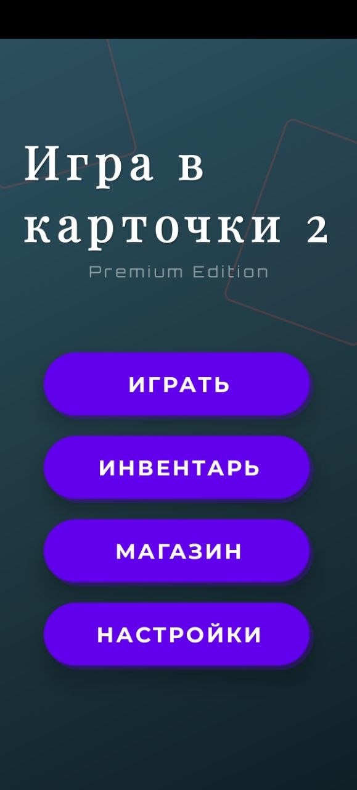
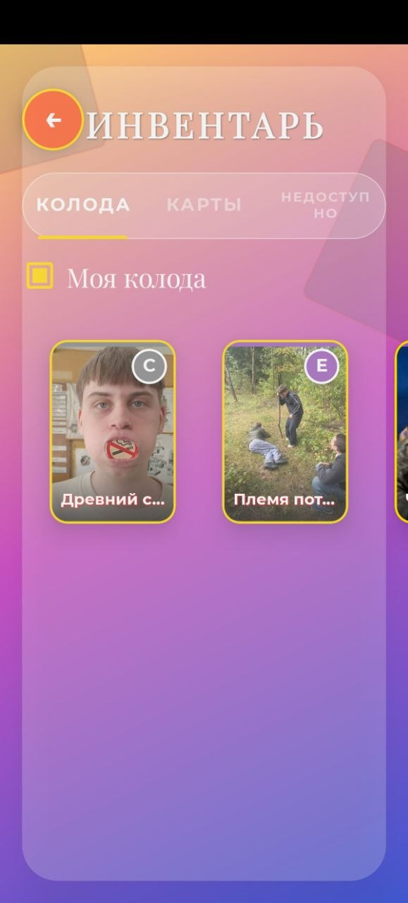
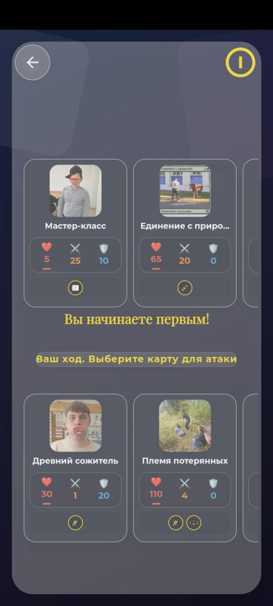
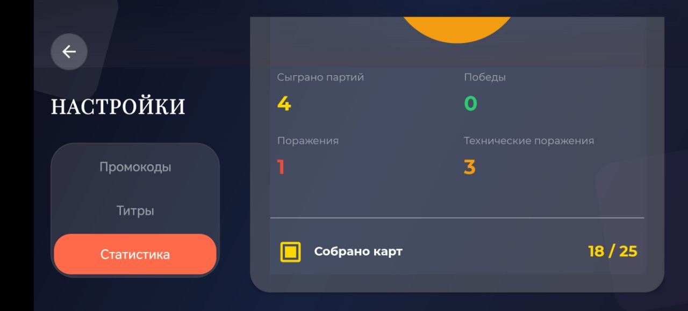
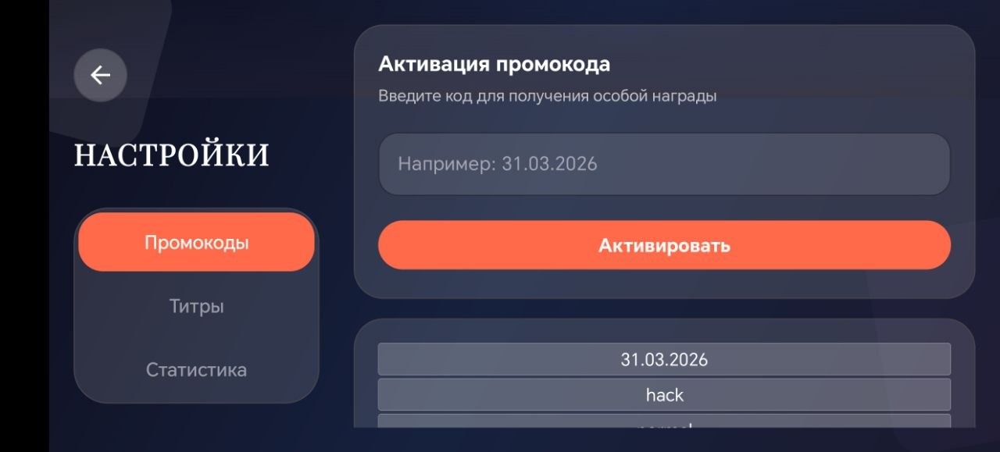
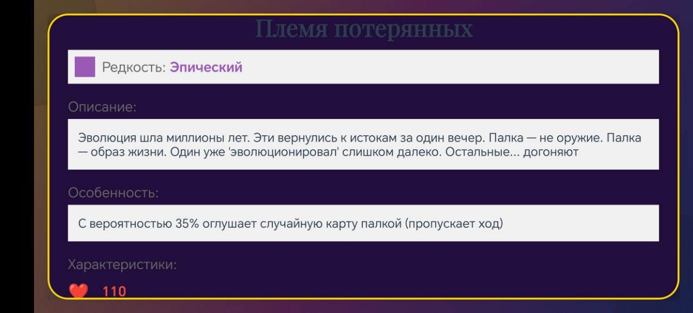

## 🃏 Игра в карточки 2


### ⚔️ Карточная игра с уникальными особенностями
### 🃏 18 уникальных карт • ✨ Система особенностей • 🎮 ИИ противник

---

## 📋 Оглавление

- [📖 О проекте](#-о-проекте)
- [✨ Возможности](#-возможности)
- [🃏 Карты и особенности](#-карты-и-особенности)
- [🎮 Игровой процесс](#-игровой-процесс)
- [📸 Демонстрация](#-демонстрация)
- [📥 Установка](#-установка)
- [🔨 Сборка из исходников](#-сборка-из-исходников)
- [🎮 Использование](#-использование)
- [🛠 Технологии](#-технологии)
- [🧱 Архитектура](#-архитектура)
- [🔧 Решение проблем](#-решение-проблем)
- [📄 Лицензия](#-лицензия)
- [📬 Контакты](#-контакты)

---

## 📖 О проекте

**Игра в карточки 2** — это карточная игра, где каждая карта имеет уникальную особенность, которая может изменить ход боя. Собирайте колоду из 3 карт, сражайтесь с ИИ и используйте особенности, чтобы одержать победу.

### 🎯 Основная задача
Собрать сильнейшую колоду из 3 карт и победить противника, используя уникальные способности каждой карты.

### 🔥 Ключевая особенность
Каждая карта имеет свою уникальную особенность с вероятностным срабатыванием — от повторной атаки до оглушения и лечения.

---

## ✨ Возможности

| Фича | Описание |
|------|----------|
| 🃏 **18 уникальных карт** | Каждая карта с индивидуальными характеристиками и особенностью |
| ⚔️ **Система боя** | Учёт здоровья, атаки, защиты. Урон сначала по щиту, затем по здоровью |
| 🎲 **Вероятностные особенности** | Шанс срабатывания от 20% до 80% |
| 🤖 **ИИ противник** | Случайный выбор карты и цели для атаки |
| 📊 **Статистика** | Подсчёт побед, поражений, технических поражений |
| 🔄 **Управление колодой** | Перемещение карт между колодой и инвентарём (максимум 3 карты) |
| 🎨 **Адаптивный UI** | Поддержка портретной и ландшафтной ориентации |
| 🌙 **Полноэкранный режим** | Иммерсивный режим без панели уведомлений |
| 🎮 **Промокоды** | Секретные коды для активации специальных эффектов |

---

## 🃏 Карты и особенности

| ID | Название | Особенность | Шанс | Иконка |
|----|----------|-------------|------|--------|
| 1 | Горохострел | Повторная атака | 20% | 🗡️ |
| 2 | Древний сожитель | Все карты атакуют повторно | 20% | 🗡️ |
| 3 | Племя потерянных | Оглушение цели | 35% | ⚡ |
| 4 | Красный дьявол | Атака x2, защита -5 | 50% | 🗡️🗡️ |
| 5 | Сын депутата | Игнорирует 50% урона, пропуск хода | 80% | 🛡️ |
| 6 | Мини Пекка | Атака +10, защита -5 | 65% | ⚔️+ |
| 7 | Мастер-класс | Лечение +15 HP, пропуск хода | 80% | 💚 |
| 8 | Единение с природой | +10 атаки навсегда, 40% шанс -5 к защите и здоровью | 50% | 🌿 |
| 9 | Роланд Азер | +39% урона всем картам | 60% | 👑 |
| 10 | Чай | Атака +18, 60% шанс задеть своих | 65% | 🍵 |

---

## 🎮 Игровой процесс

### 1️⃣ Сбор колоды
- В инвентаре доступно 18 карт
- В колоду можно добавить не более 3 карт
- Карты имеют 3 категории: Колода, Карты, Недоступно

### 2️⃣ Бой
- Случайный выбор первого хода
- Выберите карту для атаки, затем цель
- Особенности срабатывают случайным образом
- Ход передаётся после атаки

### 3️⃣ Система особенностей
- **Повторная атака** — карта атакует ещё раз
- **Оглушение** — цель пропускает следующий ход
- **Удвоение/усиление атаки** — временное увеличение урона
- **Лечение** — восстановление здоровья
- **Дружественный огонь** — атака по своим

### 4️⃣ Статистика
- Победы / Поражения / Технические поражения
- Круговая диаграмма соотношения
- Счётчик собранных карт

### 5️⃣ Промокоды
| Код | Эффект |
|-----|--------|
| `31.03.2026` | Анимация шаров |
| `hack` | Хак-режим (статистика 999) |
| `normal` | Выход из хак-режима |
| `reset` | Полный сброс игры |
| `comment` | Диалог с отзывами |

---

## 📸 Демонстрация

| 🏠 Главное меню | 🃏 Инвентарь | ⚔️ Бой |
|-----------------|--------------|--------|
|  |  |  |

| 📊 Статистика | 🎁 Промокоды | 🃏 Особенности карт |
|---------------|--------------|-------------------|
|  |  |  |

---

## 📥 Установка

### ⚡ Готовый APK

```bash
# 1. Скачайте последнюю версию
[](https://github.com/your-username/PlayingCards2/releases/latest/download/PlayingCards2.apk)

# 2. Установите файл
Разрешите "Установку из неизвестных источников" при первом запуске.
```

### 📦 Требования

| Компонент | Версия |
|-----------|--------|
| 📱 Android | 7.0+ (API 24) |
| 🌐 Интернет | Не требуется |
| 🔐 Разрешения | Нет специальных разрешений |

---

## 🔨 Сборка из исходников

### 🛠 Предварительные требования

- ✓ Android Studio Hedgehog+
- ✓ JDK 11+
- ✓ Android SDK 36
- ✓ Gradle 9.1

### 🚀 Пошаговая сборка

```bash
# 1. Клонируйте репозиторий
git clone https://github.com/your-username/PlayingCards2.git
cd PlayingCards2

# 2. Откройте в Android Studio
#    Проект автоматически подгрузит зависимости

# 3. Соберите проект
./gradlew build

# 4. Установите на устройство
./gradlew installDebug
```

---

## 🎮 Использование

### 1️⃣ Запуск игры
Приложение запускается с экрана дисклеймера, затем открывается главное меню.

### 2️⃣ Главное меню
| Кнопка | Действие |
|--------|----------|
| 🎮 **Играть** | Начать бой (оффлайн режим) |
| 🃏 **Инвентарь** | Управление колодой и картами |
| 🛒 **Магазин** | Информационное сообщение |
| ⚙️ **Настройки** | Промокоды, титры, статистика |

### 3️⃣ Инвентарь
- Перемещайте карты между колодой и инвентарём
- Нажмите на карту для перемещения
- Долгое нажатие открывает детали карты
- Анимация "Чудик" для карты "Красный дьявол"

### 4️⃣ Бой
- Выберите карту для атаки
- Выберите цель
- Наблюдайте за анимацией и срабатыванием особенностей
- Оглушённые карты не могут атаковать и затемнены

### 5️⃣ Настройки
- **Промокоды** — введите код для активации эффекта
- **Титры** — информация о создателях и ссылка на GitHub
- **Статистика** — ваши достижения в игре

---

## 🛠 Технологии

- 📱 **Kotlin** — основной язык разработки
- 🎨 **Material Design** — современный UI
- 📦 **RecyclerView** — отображение списков карт
- 🎭 **Lottie** — анимация "Чудик"
- 💾 **SharedPreferences** — сохранение прогресса
- 🎮 **Gson** — сериализация данных

### 📊 Распределение кода

| Язык | Роль |
|------|------|
| 🟣 **Kotlin** | Вся логика игры, особенности, анимации |
| 🎨 **XML** | Ресурсы, макеты, стили |

---

## 🧱 Архитектура

```
app/
├── src/main/
│   ├── java/com/printer/playingcards2/
│   │   ├── MainActivity.kt           # Главное меню
│   │   ├── SplashActivity.kt         # Экран дисклеймера
│   │   ├── GameActivity.kt           # Игровой процесс
│   │   ├── InventoryActivity.kt      # Инвентарь
│   │   ├── SettingsActivity.kt       # Настройки
│   │   ├── CardSpecialEffect.kt      # Управление особенностями
│   │   ├── CardAdapter.kt            # Адаптер карт в инвентаре
│   │   ├── GameCardAdapter.kt        # Адаптер карт в игре
│   │   ├── CreditsAdapter.kt         # Адаптер титров
│   │   ├── Card.kt                   # Модель карты
│   │   ├── GameCard.kt               # Модель карты для игры
│   │   ├── CreditItem.kt             # Модель титров
│   │   ├── Rarity.kt                 # Перечисление редкостей
│   │   └── CardCategory.kt           # Перечисление категорий
│   ├── res/
│   │   ├── drawable/                 # Иконки и фоны
│   │   ├── layout/                   # Макеты (портретная ориентация)
│   │   ├── layout-land/              # Макеты (ландшафтная ориентация)
│   │   ├── values/                   # Стили и строки
│   │   └── font/                     # Кастомные шрифты
│   └── AndroidManifest.xml           # Манифест приложения
```

### 🔄 Игровой цикл

```kotlin
// GameActivity.kt
private fun performAttack(attacker: GameCard, target: GameCard) {
    // 1. Проверка на оглушение
    // 2. Применение особенностей (удвоение, бафф, лечение)
    // 3. Расчет урона с учётом щита
    // 4. Применение урона
    // 5. Проверка смерти
    // 6. Проверка повторной атаки
    // 7. Смена хода
}
```

### 🌟 Система особенностей

```kotlin
// CardSpecialEffect.kt
fun checkExtraAttackTriggers(attacker: GameCard, allCards: List<GameCard>): List<SpecialEffectInfo> {
    // 1. Горохострел (id=1) - 20% повторная атака
    // 2. Древний сожитель (id=2) - 20% все карты атакуют повторно
}
```

---

## 🔧 Решение проблем

### ❌ Ошибка: «Бессмертие карт» (здоровье отрицательное)

**Причина:** Проверка смерти после обновления UI

**Решение:** Проверять смерть сразу после нанесения урона:

```kotlin
// ✅ Правильно
target.currentHealth -= damage
if (target.currentHealth <= 0) {
    target.isAlive = false
    // удаление карты
}
```

### ❌ Ошибка: «ANR (Application Not Responding)» при анимации

**Причина:** Тяжёлые вычисления на главном потоке

**Решение:** Использовать Handler для задержек:

```kotlin
// ✅ Правильно
Handler(Looper.getMainLooper()).postDelayed({
    // анимация
}, delay)
```

### ❌ Ошибка: «Дублирование ресурсов» themes.xml и styles.xml

**Причина:** Тема определена в двух файлах

**Решение:** Оставить тему только в `themes.xml`:

```xml
<!-- themes.xml -->
<style name="Theme.PlayingCards2" parent="Theme.MaterialComponents.DayNight.NoActionBar">
    <!-- стили темы -->
</style>
```

### ❌ Ошибка: «Unresolved reference» в адаптерах

**Причина:** Неправильные имена полей в CreditItem

**Решение:** Использовать правильные поля:

```kotlin
// ✅ Правильно
title.text = credit.role
description.text = credit.name
```

---

## 📄 Лицензия

[](LICENSE)

Проект распространяется под лицензией MIT.

---

## 📬 Контакты

### 💬 Вопросы по игре или баги?

[](https://github.com/Andrey3141)

---

## 🚀 Скачать

[](https://github.com/Andrey3141/PlayingCards2/releases)

**Игра в карточки 2** — собирай колоду, используй особенности карт и побеждай! 🃏⚔️

*Сделано с ❤️ на Kotlin + Android*
```
